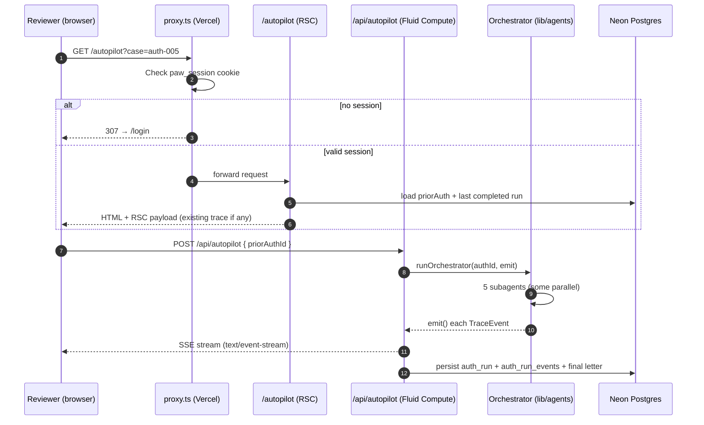
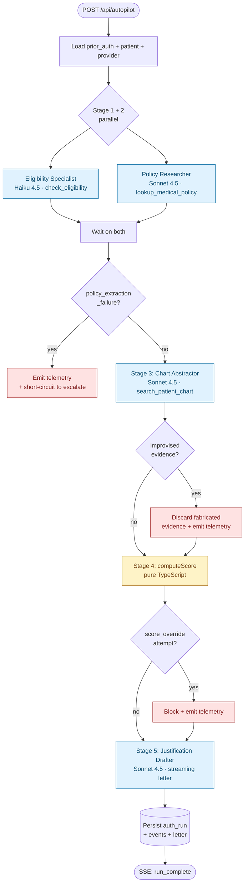
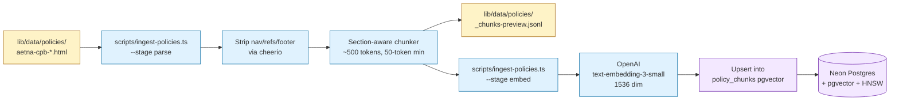
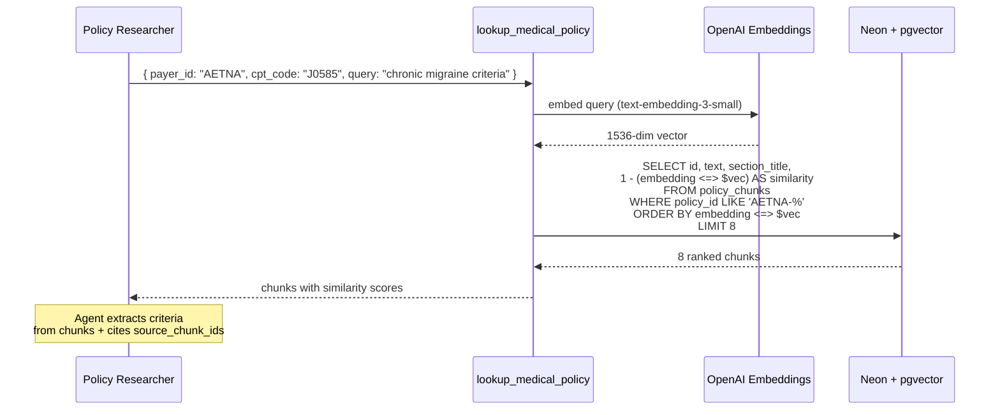

# PreAuthWiz — Architecture Deep Dive

This document explains how PreAuthWiz implements its **agent pipeline**, **RAG over payer policies**, and **Vercel platform integration**. It complements the README — read that first for the bird's-eye view.

The companion in-app surface is the **Technical Notes** dialog (side nav → ⌘ Layers icon), which gives the same story in a 5-step skim.

---

## 1. Top-level request flow

A reviewer signs in, picks a case from the Auto-Pilot dropdown, and hits **Run**. From that click to a finished letter, here's what happens end-to-end:



Key distinctions:
- **`proxy.ts`** is Next.js 16's renamed middleware file convention — runs on every request, gates everything except `/login` and `/api/auth/*` behind the `paw_session` cookie.
- **The page** is a React Server Component. It loads existing run data (if any) at request time and hydrates the client.
- **The API route** is a long-lived SSE function on Vercel Fluid Compute (`maxDuration = 300`). It calls the orchestrator and streams every event back to the browser.
- **The orchestrator** is plain TypeScript — not an agent itself. It coordinates five `ToolLoopAgent` instances and emits events.

---

## 2. Agent architecture

### 2.1 The five subagents

Every subagent is an [AI SDK v6](https://ai-sdk.dev) `ToolLoopAgent` — a typed loop that calls a model with a `tools` map until the model produces a structured output. We use Anthropic Claude under the hood (`claude-sonnet-4-5` and `claude-haiku-4-5-20251001`), wired through `@ai-sdk/anthropic`.

| # | Subagent | Model | Tool | What it produces |
|---|---|---|---|---|
| 1 | **Eligibility Specialist** | Haiku 4.5 | `check_eligibility` | `{ covered, plan_name, network_status, requires_prior_auth, notes }` |
| 2 | **Policy Researcher** | Sonnet 4.5 | `lookup_medical_policy` (RAG) | `criteria[]` — array of `{ id, kind, text, source_quote, source_chunk_ids }` |
| 3 | **Chart Abstractor** | Sonnet 4.5 | `search_patient_chart` (FHIR) | `evidence[]` — array of `{ source_type, source_id, date, excerpt }` |
| 4 | **Risk Scorer** | Haiku 4.5 + pure TS | none — narrative only | `{ score, verdict, narrative }` (score is computed in TS, not LLM) |
| 5 | **Justification Drafter** | Sonnet 4.5 | none — composes letter | streamed markdown letter with citations |

Why Sonnet for the heavy three (policy interp, chart abstraction, letter) and Haiku for the structured ones (eligibility, scorer narrative)? Reasoning-heavy work needs Sonnet; bounded JSON extraction is fine on Haiku and ~5× cheaper.

### 2.2 Orchestrator topology

The orchestrator runs subagents in three phases — a parallel fan-out, a sequential dependency stage, and a final draft:



The Stage 1+2 parallel fan-out matters: eligibility and policy retrieval don't depend on each other, so dispatching them simultaneously cuts ~10–15s off the wall-clock. Implementation in `lib/agents/orchestrator.ts`:

```ts
const [eligibilityResult, policyResult] = await Promise.all([
  eligibilitySpecialist.generate({ messages: [...] }),
  policyResearcher.generate({ messages: [...] }),
]);
```

### 2.3 Why deterministic scoring

The Risk Scorer is the most opinionated design choice in this codebase. The LLM does **not** decide the verdict. The verdict is computed by a pure-TypeScript function called `computeScore()` in `lib/agents/risk-scorer.ts`:

```ts
// Thresholds applied after meeting/blocking criteria are tallied
if (score >= 0.9)  verdict = 'auto_approve_eligible';
else if (score >= 0.6) verdict = 'escalate_for_review';
else                verdict = 'recommend_deny';
```

The LLM's only job in this stage is to **narrate** the score in a sentence or two for the trace UI — and even that output is validated against the score we already computed. If the model tries to flip a verdict (e.g., the score is 0.45 but the narrative says "approve"), the orchestrator catches it and emits a `score_override` telemetry event.

This is the single biggest reliability lever in the system. LLMs are bad at consistent-threshold math; they're great at narrative. Letting code do math and the LLM do words means the verdict is reproducible across runs, defendable to a regulator, and the eval harness can assert it deterministically.

---

## 3. RAG implementation

The Policy Researcher subagent uses RAG over a corpus of payer medical policies. Today only **Aetna** is indexed (`aetna-cpb-0113.html`, `aetna-cpb-0462.html`); the structure is payer-agnostic.

### 3.1 Ingestion pipeline



Stages are explicit and idempotent (`pnpm ingest --stage parse` then `pnpm ingest --stage embed`) so policy authors can preview the chunk boundaries before paying for embeddings.

**Chunking strategy** (`scripts/ingest-policies.ts`):
- Section headings (`<h2>`, `<h3>`) drive splits — preserves the policy's logical boundaries (Background, Criteria, Exclusions, References).
- Whole sections like References are stripped entirely (no value for retrieval, lots of noise).
- Minimum 50-token chunks; sub-50-token fragments are dropped.
- Each chunk records `policy_id`, `section_title`, `chunk_idx`, `text`, `approx_tokens`, `embedding`.

**Embedding model**: OpenAI `text-embedding-3-small` at 1536 dimensions. Chosen because: (a) it's cheap ($0.02/M input tokens), (b) it's a Matryoshka model so we could shrink to 512 or 256 dims later if storage gets tight, and (c) Anthropic doesn't ship an embedding model.

### 3.2 Vector storage

Schema in `lib/db/schema.ts`:

```ts
export const policyChunks = pgTable('policy_chunks', {
  id: uuid('id').primaryKey().defaultRandom(),
  policyId: text('policy_id').notNull(),
  sectionTitle: text('section_title'),
  chunkIdx: integer('chunk_idx').notNull(),
  text: text('text').notNull(),
  approxTokens: integer('approx_tokens').notNull(),
  embedding: vector('embedding', { dimensions: 1536 }),
});
```

The HNSW index is created in a hand-written migration since Drizzle doesn't have native pgvector index support yet (`lib/db/migrations/0001_hnsw_index.sql`):

```sql
CREATE INDEX IF NOT EXISTS policy_chunks_embedding_idx
  ON policy_chunks USING hnsw (embedding vector_cosine_ops);
```

**Why HNSW + cosine**: cosine distance is the standard for OpenAI embeddings (they're L2-normalized at output). HNSW gives sub-millisecond approximate-nearest-neighbor on the corpus we have today; for 10× the corpus, we'd revisit `m` and `ef_construction` parameters but the index type stays the same.

### 3.3 Retrieval at query time



Implementation in `lib/tools/lookup-medical-policy.ts` (~90 lines, simpler than it sounds):

```ts
const queryVec = await embed(query);  // OpenAI 1536d

const rows = await db
  .select({
    id: policyChunks.id,
    text: policyChunks.text,
    sectionTitle: policyChunks.sectionTitle,
    similarity: sql<number>`1 - (${policyChunks.embedding} <=> ${queryVec}::vector)`,
  })
  .from(policyChunks)
  .where(/* filter by payer */)
  .orderBy(sql`${policyChunks.embedding} <=> ${queryVec}::vector`)
  .limit(8);
```

The `<=>` operator is pgvector's cosine distance; `1 - distance` gives similarity for human-readable scores.

### 3.4 Anthropic prompt caching

Retrieved chunks are expensive to send to Sonnet — a typical retrieval is ~3K tokens. Without caching, every Auto-Pilot run re-tokenizes the same policy text.

Each Sonnet subagent that consumes retrieved chunks attaches `providerOptions.anthropic.cacheControl`:

```ts
// lib/agents/policy-researcher.ts
return new ToolLoopAgent({
  model: sonnet,
  system: [
    {
      role: 'system',
      content: SYSTEM_PROMPT,
      providerOptions: {
        anthropic: { cacheControl: { type: 'ephemeral', ttl: '1h' } },
      },
    },
  ],
  tools: { lookup_medical_policy },
  output: Output.object({ schema: criteriaSchema }),
});
```

**Effect on cost**: first run pays full token rate (~$0.30/run). Subsequent runs within the 1h cache window pay ~10% of input tokens — total cost drops to ~$0.06/run. The 1h TTL is the longer of the two Anthropic offers (5m / 1h); the 5m would force re-cache too often for our demo cadence.

---

## 4. Defense in depth — three real validators

Three telemetry events surface real agent misbehavior on real cases. They're not aspirational — they fired on actual bugs during development, and the eval harness has a case for each one. Implementation lives in `lib/agents/orchestrator.ts`.

```mermaid
graph LR
    LLM1[LLM: tries to override<br/>verdict in narrative] --> Code1{computeScore validator}
    Code1 -->|verdict mismatch| Block1[BLOCK · keep TS-computed score]
    Block1 --> Emit1[emit score_override event]

    LLM2[Policy Researcher:<br/>returns empty/malformed criteria] --> Code2{empty check}
    Code2 -->|no criteria| Flag2[FLAG · short-circuit to escalate]
    Flag2 --> Emit2[emit policy_extraction_failure event]

    LLM3[Chart Abstractor:<br/>cites a fact not in FHIR bundle] --> Code3{evidence cross-check}
    Code3 -->|source_id not in chart| Discard3[DISCARD · drop fabricated entry]
    Discard3 --> Emit3[emit improvised_evidence_discarded event]

    Emit1 --> Trace[(auth_run_events)]
    Emit2 --> Trace
    Emit3 --> Trace

    Trace --> UI[Trace page<br/>amber/red event borders]
    Trace --> Dash[Dashboard<br/>"AI safety nets fired" banner]

    classDef red fill:#fee2e2,stroke:#991b1b,color:#7f1d1d
    classDef yellow fill:#fef3c7,stroke:#a16207,color:#713f12
    classDef ui fill:#e0f2fe,stroke:#0369a1,color:#0c4a6e

    class Emit1,Emit2,Emit3,Block1,Flag2,Discard3 red
    class Code1,Code2,Code3 yellow
    class Trace,UI,Dash ui
```

### `score_override`

The Risk Scorer's narrative is generated by Haiku, but the verdict and score are pure TypeScript. We've seen Haiku occasionally write narratives that contradict the score ("the verdict is auto-approve" when score is 0.45). The orchestrator catches this and never lets the narrative override the deterministic verdict. The eval case `auth-005-canonical-escalate` has `score_override_events: 0` baked into its assertions — if this validator regresses, the case fails.

### `policy_extraction_failure`

If the Policy Researcher returns empty or malformed criteria (e.g., RAG returned nothing, model decided "I don't have policy info"), the orchestrator short-circuits to `escalate_for_review` — the safe verdict. Without this, the Risk Scorer would silently default-pass on `0 / 0` criteria. Eval case: `empty-criteria-fail-safe`.

### `improvised_evidence_discarded`

The Chart Abstractor must cite a `source_id` that exists in the patient's FHIR bundle. We've seen Sonnet fabricate plausible-sounding observation IDs that don't exist. The orchestrator cross-checks each cited source against the bundle and drops anything ungrounded before it reaches the letter. Eval case: `narrative-grounding-no-fabrication`.

---

## 5. Vercel platform integration

### 5.1 What we use

| Vercel feature | Where | Why |
|---|---|---|
| **Next.js 16 App Router** | All pages | RSC + streaming + the new `proxy.ts` file convention |
| **`proxy.ts`** | Repo root | Auth gate for all routes; replaces middleware in Next 16 |
| **Fluid Compute** | `/api/autopilot` (default for Node API routes) | Long-lived SSE function, 300s `maxDuration`, request reuses warm instances |
| **AI SDK v6** | All agents + chat | `ToolLoopAgent`, `streamText`, `useChat`, structured outputs via `Output.object` |
| **`@ai-sdk/anthropic`** | All Claude calls | Direct provider for fine-grained prompt-cache control |
| **Neon Postgres (Marketplace)** | Everything DB-backed | pgvector + HNSW for RAG; auth runs + events for trace |
| **Env vars (encrypted)** | All secrets | `ANTHROPIC_API_KEY`, `OPENAI_API_KEY`, `DATABASE_URL`, `PAW_ACCESS_PASSWORD` |
| **Aliased custom URL** | `preauthwiz.vercel.app` | Stable URL for sharing demos with reviewers |

### 5.2 What we explicitly didn't use (and why)

- **Vercel AI Gateway** — would be a clean swap for production multi-provider routing. Skipped here because we want fine-grained control over Anthropic's prompt-cache `ttl: '1h'` flag, which is provider-specific. The cost optimization on retrieved chunks matters more than provider abstraction in this demo.
- **Vercel KV / Redis** — no caching layer needed. Anthropic's prompt cache already covers the expensive path. Browser-side `useChat` handles UI state.
- **Vercel Queues** — would make sense if we batched eval runs or pre-warmed prompt caches for the demo. For now `pnpm eval` runs synchronously.
- **Edge functions** — explicitly avoided. Edge has compatibility issues; everything here runs on Node via Fluid Compute. Per current Vercel guidance.

### 5.3 Function timeouts

The orchestrator runs ~90–120s on a cold prod hit (5 sequential subagents + RAG + uncached Anthropic). Default function timeout is 300s on all plans, so:

```ts
// app/api/autopilot/route.ts
export const maxDuration = 300;

// app/api/chat/route.ts (multi-step tool chains via stepCountIs(8))
export const maxDuration = 120;
```

Originally these were both 60s and the autopilot SSE stream was getting killed mid-run on prod. Bumping to 300s fixed it without any plan upgrade.

### 5.4 Auth gate (`proxy.ts`)

Cookie-based, no DB lookup, no session table — overkill is a real failure mode in demos. Just a persona id (`'aisha'` or `'jamie'`) signed via HttpOnly cookie. The shared **access password** (`PAW_ACCESS_PASSWORD` env var) is verified once at sign-in via constant-time compare; after that the cookie does the rest.

```ts
// proxy.ts
export function proxy(request: NextRequest) {
  const persona = findPersona(request.cookies.get('paw_session')?.value);
  if (!persona) {
    const loginUrl = new URL('/login', request.url);
    loginUrl.searchParams.set('next', request.nextUrl.pathname + request.nextUrl.search);
    return NextResponse.redirect(loginUrl);
  }
  return NextResponse.next();
}

export const config = {
  matcher: ['/((?!login|api/auth|_next/static|_next/image|favicon.ico).*)'],
};
```

The matcher excludes `/login` (the picker page) and `/api/auth/*` (login/logout/tour-seen routes) so unauthenticated users can sign in. Everything else 307s to `/login?next=...`.

### 5.5 SSE on Fluid Compute

The Auto-Pilot route is a single `POST` that opens a `ReadableStream` and emits `data: <event>\n\n` lines for every trace event. The browser uses the AI SDK's stream-reader pattern to parse them and update the live trace UI in real time. No WebSockets, no polling.

```ts
// app/api/autopilot/route.ts
const stream = new ReadableStream({
  async start(controller) {
    function emit(event: TraceEvent) {
      controller.enqueue(encoder.encode(`data: ${JSON.stringify(event)}\n\n`));
    }
    try {
      await runOrchestrator(priorAuthId, emit);
    } catch (err) {
      emit({ type: 'run_error', error: String(err) });
    }
    controller.close();
  },
});

return new Response(stream, {
  headers: {
    'Content-Type': 'text/event-stream',
    'Cache-Control': 'no-cache, no-transform',
    'Connection': 'keep-alive',
  },
});
```

Fluid Compute keeps the function warm across concurrent requests, so back-to-back demo runs share the JIT-compiled code path and the Anthropic prompt cache stays hot.

---

## 6. Eval harness

Covered in detail in the in-app **Eval Harness** page (`/evals`) — including a "view full source" disclosure that surfaces `lib/eval/cases.ts` directly. The short version:

- 10 cases, three categories (regression / adversarial / edge)
- Each runs against the **full pipeline** — same orchestrator, same models, same DB. No mocks.
- Boundary cases use `verdict_one_of: [...]` to assert an acceptable verdict set instead of a single answer (handles temp-0 jitter without flakiness)
- Each case can also assert: `blocking_count`, `criteria_count_min/max`, `score_min/max`, `*_events: 0` (defense-in-depth telemetry counts), and `letter_must_contain: [...]` (string-presence assertions on the final letter)
- Runner: `pnpm eval` (CLI) or visit `/evals` (UI)
- Ship gate: **10/10 PASS** before any prompt change goes out

---

## 7. File layout

```
app/
  api/
    autopilot/route.ts       SSE orchestrator endpoint (maxDuration: 300)
    chat/route.ts            Chat assistant streamText (maxDuration: 120)
    auth/{login,logout,tour-seen}/route.ts   Cookie-based auth handlers
    evals/run/route.ts       Stub (eval runs are CLI only today)
  autopilot/
    page.tsx                 RSC: loads existing run, passes options to client
    _components/             Live trace UI, SSE consumer
    trace/[runId]/           Full event timeline view
  auth-queue/page.tsx        Worklist with status/payer/search filters
  chat/                      useChat-based assistant
  evals/page.tsx             Harness results + source viewer
  login/page.tsx             Persona picker + access password
  page.tsx                   Dashboard

lib/
  agents/
    orchestrator.ts          Coordinates 5 subagents, emits TraceEvents
    eligibility-specialist.ts
    policy-researcher.ts
    chart-abstractor.ts
    risk-scorer.ts           Pure-TS computeScore() + narrative agent
    justification-drafter.ts
  ai/
    models.ts                Sonnet 4.5 + Haiku 4.5 model handles
    prompts/                 System prompts per subagent (with cache markers)
  auth/
    personas.ts              Persona registry (id, names, login fields)
    session.ts               Cookie helpers
  db/
    schema.ts                Drizzle schema incl. policy_chunks vector column
    migrations/              0001_hnsw_index.sql etc.
  eval/
    cases.ts                 The 10-case suite (visible at /evals)
    runner.ts                Sequential per-case execution
    checks.ts                Assertion helpers (verdict, score, telemetry)
    persist.ts               Reads/writes .eval-results/latest.json
  schemas/                   Zod schemas (TraceEvent, EvidenceItem, etc.)
  tools/
    check-eligibility.ts     Mock eligibility lookup
    lookup-medical-policy.ts RAG retrieval (used by policy researcher)
    search-patient-chart.ts  FHIR bundle reader (used by chart abstractor)
    chat-tools.ts            Chat-specific wrappers (getActiveAuths, etc.)

scripts/
  seed-data.ts               Synthetic patients + providers + auths
  ingest-policies.ts         Two-stage parse + embed pipeline
  eval.ts                    pnpm eval entry point
  inspect-run.ts             CLI to dump a single run's events

proxy.ts                     Next 16 auth gate (renamed from middleware.ts)
next.config.ts               Turbopack root config
```

---

## 8. What I'd build next (if this were a real product)

- **More payers indexed** — Anthem, BCBS, Cigna currently in the queue but not in the policy corpus. Adding each is `pnpm ingest` against new HTML.
- **Real EHR integration** — replace `lib/data/charts/*.json` with a SMART-on-FHIR client. Tool surface is identical; only the data source changes.
- **Streaming letter back to the reviewer** — currently the letter renders after the drafter completes. The drafter already supports `streamText`; wiring it into the live UI is one bind away.
- **Multi-provider fallback** — wrap `@ai-sdk/anthropic` calls in a Vercel AI Gateway provider with Haiku → Sonnet → GPT fallback. Useful when Anthropic is rate-limited and demos can't wait.
- **Eval harness in CI** — the suite runs cleanly via `pnpm eval`, but isn't currently wired to PR checks. A GitHub Action that fails on <10/10 would be the obvious next step.
- **Cost-per-run dashboard** — every run already persists `total_cost_cents`; surface a 30-day rollup so a finance reviewer sees the unit economics.
