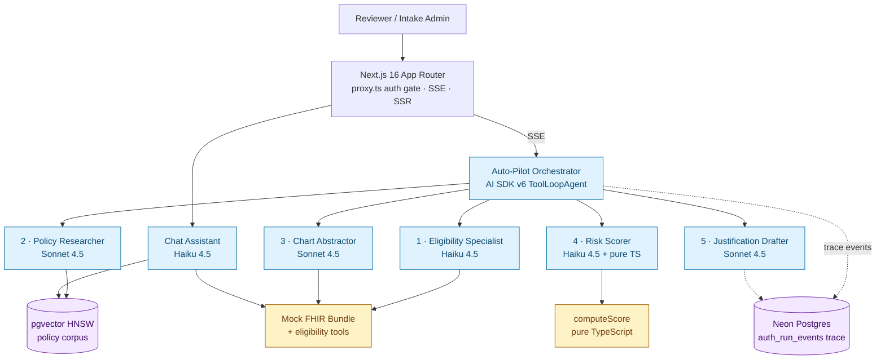

# PreAuthWiz

**AI prior authorization automation for Meridian Health.** Reads the patient's chart, matches payer policy, scores medical necessity, and drafts a citation-grounded justification letter — every claim traceable to its chart note or policy paragraph.

Built as a Vercel takehome. Next.js 16 App Router · AI SDK v6 · Anthropic Claude · Neon Postgres + pgvector.

> **Live demo:** https://preauthwiz.vercel.app — ask the team for the access password.

---

## What it does

Prior authorizations eat 30+ minutes of clinician time per case (chart reading, policy hunting, letter drafting). PreAuthWiz collapses that to ~90 seconds:

1. **Eligibility check** — coverage, network status, formulary
2. **Policy retrieval** — RAG over payer medical policy corpus
3. **Chart abstraction** — pulls evidence from the patient's FHIR Bundle with chart citations
4. **Risk scoring** — deterministic TypeScript (not LLM math) with explicit thresholds
5. **Letter drafting** — citation-grounded justification, ready for a human to sign

A reviewer then approves, edits, or sends back. PreAuthWiz never submits to payers autonomously.

## Architecture



## Why agents instead of one big LLM call

- **Specialization** — each agent has a narrow prompt and a narrow toolbelt; results are easier to evaluate
- **Parallelism** — eligibility, policy, and chart fan out simultaneously
- **Auditability** — every tool call, every retrieved policy chunk, every cited chart fact lands in `auth_run_events` and can be replayed on the Trace page
- **Determinism** — the risk score itself is a pure-TypeScript function with explicit thresholds (≥0.9 auto-approve · ≥0.6 escalate · <0.6 deny). The LLM only writes the human-readable narrative

## Defense in depth

Three telemetry events fire when an agent misbehaves on a real case:

| Event | Trigger | What we do |
|-------|---------|-----------|
| `score_override` | LLM tried to talk the scorer into a different verdict | Block. Score stays as the deterministic computation. |
| `policy_extraction_failure` | Policy researcher returned empty/malformed criteria | Flag the run. Reviewer sees the failure rather than a confidently-wrong letter. |
| `improvised_evidence_discarded` | Chart abstractor cited a fact not in the chart | Discard before it can reach the letter. |

These show up on the Trace page (amber/red event borders) and the Dashboard's "AI safety nets fired" banner.

## Eval harness

A 10-case suite at `lib/eval/cases.ts`:

- **2 regression cases** — canonical demo (Aaliyah Johnson new request, Marcus Chen continuation)
- **4 adversarial cases** — non-neurologist prescriber, episodic vs chronic migraine, missing policy, etc
- **4 edge cases** — partial preventive trial, stale headache diary, PCP-prescriber, etc

Each case asserts the expected verdict and (optionally) blocking-criteria count and specific evidence claims. Boundary cases use `verdict_one_of` to handle temp-0 jitter without making the suite flaky.

```bash
pnpm eval        # CLI
# or visit /evals in the app
```

The ship gate before any prompt change: **10/10 PASS**.

## Tech stack

- **Frontend** — Next.js 16 (App Router, `proxy.ts` file convention), Tailwind v4, shadcn/ui, Geist + Instrument Serif
- **AI orchestration** — AI SDK v6 (ToolLoopAgent for subagents, streamText + useChat for the chat assistant, SSE for live activity streaming)
- **Models** — Anthropic Claude Sonnet 4.5 + Haiku 4.5 with prompt caching (`cacheControl: ephemeral, ttl: 1h`) on retrieved policy chunks
- **Data** — Neon Postgres, Drizzle ORM, pgvector with HNSW indexing
- **Embeddings** — OpenAI `text-embedding-3-small` at 1536 dimensions
- **Auth** — cookie-based persona session gated by a shared access password (env: `PAW_ACCESS_PASSWORD`)
- **Deploy** — Vercel (Fluid Compute for SSE routes)

## Local development

```bash
pnpm install
cp .env.local.example .env.local
# Fill in DATABASE_URL (Neon), OPENAI_API_KEY, ANTHROPIC_API_KEY, PAW_ACCESS_PASSWORD

pnpm db:migrate  # apply schema
pnpm seed        # seed synthetic patients, providers, prior auths
pnpm ingest      # chunk + embed payer policy corpus into pgvector

pnpm dev         # http://localhost:3000
```

Sign in with whatever value you set for `PAW_ACCESS_PASSWORD`, then pick a persona.

## Project structure

```
app/                    Next.js App Router
  api/                  Route handlers (autopilot SSE, chat, evals, auth)
  autopilot/            Auto-Pilot UI + trace view
  auth-queue/           Worklist
  chat/                 Conversational assistant
  evals/                Eval harness UI
  login/                Persona picker + access password gate
  page.tsx              Dashboard

components/             Shared UI (nav, app-shell, dashboard cards, dialogs)

lib/
  agents/               5 subagents + orchestrator
  ai/                   Model config, prompts, prompt-caching helpers
  auth/                 Persona registry + session helper
  data/                 Synthetic seed data (patients, providers, prior auths)
  db/                   Drizzle schema + Neon client
  eval/                 Eval cases + runner + checks
  schemas/              Zod schemas for trace events, eligibility, etc
  tools/                Mock FHIR + eligibility + policy lookup tools

scripts/                seed-data.ts · ingest-policies.ts

proxy.ts                Next 16 auth gate (renamed from middleware.ts)
```

## Notes on the demo data

- Patients, providers, and prior auths are synthetic. **No real PHI.**
- The canonical demo case (auth-005) is set up so the pipeline produces a stable `escalate_for_review` verdict; auth-013 is the continuation case that auto-approves.
- Only Aetna's policy corpus is actually indexed for RAG — the other payers (Anthem, BCBS, Cigna, Humana, Medicare, UHC) appear in the demo queue but aren't retrievable yet. Adding more is just `pnpm ingest` + the policy HTML.
